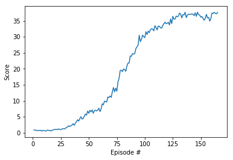

[//]: # (Image References)

[image1]: https://user-images.githubusercontent.com/10624937/43851024-320ba930-9aff-11e8-8493-ee547c6af349.gif "Trained Agent"

# Project 2: Reacher with DDPG Report

### Problem Statement/Environment Introduction:

![Trained Agent][image1]

##### Rewards:
- **Reward of +0.1 for every step agent's hand is in goal location**

##### State Space
The state space consists of 33 variables corresponding to position, rotation, velocity, and angular velocities of the arm.

##### Actions:
Every entry in the action vector should be a number between -1 and 1 relating to control of joints for the arm.

##### Succesful Completion Criteria
The task is episodic, and in order to solve the environment, your agent must get an average score of +30 over 100 consecutive episodes.

### Learning Algorithm 

##### Algorithm: DDPG
DDPG stands for Deep Deterministic Policy Gradient. The main methodology of this algorithm is to represent both the Q-Value(Critic) and Actor as a neural network. Critic will then try to learn to generate state-action pairs by comparing it's output from previous experiences,  while Actor try to learn how to maximize the Q-value generated from the critic. Similar to DQN, this is a two step algorithm:

**1.Sample Step**
In this step, given the current state we are in, we use our *actor* network to choose an action, and apply Ornstein-Uhlenbeck Noise to add some exploration and randomness. Then we interact with the environment and store/record the interaction (state, action, reward, next\_state, done) into the <em>replay buffer</em> for later learning use.

```
action_from_nn = actor_local_network(current_state)
noise = OUNoise.sample()
action = np.clip(action_from_nn + noise, -1.0, 1.0)
```

**2.Learn Step**
We sample a batch of experiences from the learning buffer and update our networks with this loss function:

**Critic Loss:**
We can use current critic network and state-action pair to obtain Q-value prediction. Then we use next_states and target actor network to predict next_actions. Then we target critic network to predict next state-action pairs Q-values. Then we use current rewards and predicted next state-action pairs Q-values to do a TD-0 estimate to estimate the true Q-value and use it as a label. we then apply MSE loss on the Q-prediction and label.
```
Q_prediction = self.critic_local(states, actions)
next_actions = self.actor_target(next_states)
Q_label = rewards + (gamma * self.critic_target(next_states, next_actions) * (1-dones))
loss = mse_loss(Q_prediction,Q_label)
```

**Actor Loss:**
The actor first predicts actions given current states. Then we add these states-predicted action pair into critic and get it's negative-mean value of the output. The intuition is we want the action network to learn how to maximize it's predicted score(which is obtained/decided from the critic network).
```
actions_pred = self.actor_local(states)
actor_loss = -self.critic_local(states,actions_pred).mean()
```

**Mods to stabilize Training**
We are using fixed target learning with soft updates. i.e *_target and *_local are networks with exactly same structure. *_target is technically an interpolated version of *_local from previous iterations. This is done S.T we can have a more stable learning to prevent <em>moving target</em> problem and stabilize training. 

We are also only updating after certain time steps, and during that time step we learn multiple times. This is also to stabilize training.

##### Hyperparameters

Model/Agent Parameters:
```bash
BUFFER_SIZE = int(1e6)  # replay buffer size
BATCH_SIZE = 128         # minibatch size
GAMMA = 0.99            # discount factor
TAU = 1e-3              # for soft update of target parameters
LR_ACTOR = 1e-3         # learning rate of the actor
LR_CRITIC = 1e-3        # learning rate of the critic
WEIGHT_DECAY = 0.0      # L2 weight decay

N_LEARN_UPDATES = 10     # number of learning updates
N_TIME_STEPS = 20       # every n time step do update```
```

Runtime parameters:
```bash
- n_episodes = 300  # Number of epsiodes we trained on
- max_tstep = 1000   # Max number of time step agent runs on during training
```


#### Neural Network Architecture

**Actor network:**
The main important factor of the actor's NN architecture is to have input as large as the state space, and output layer as large as action space. Since the input is vector, we can use FC Networks. For this problem we use a simple 3-Layer FC with leaky Relu activation to represent non-linearity. Additionally since we need the output to have value between [-1,1] we use tanh for the activation on output layer. Hence  the layers becomes:

1. FC-Layer(33, 256)
2. leaky_relu(256)
3. FC-Layer(256, 128)
4. leaky_relu(128)
5. FC-Layer(128, 4)
6. tanh(4)

**Critic network:**
The important factor is it takes in state size in the first layer, and the second layer will be combination of fc1 layer units and action size, since we will insert the action size in fc2. Output will be 1 since the Q-value for state-action pair is size 1. We use 4-Layer FC with leaky relu activation for non-linearity.

1. FC-Layer(33, 256)
2. leaky_relu(256)
3. FC-Layer(256+4, 128) (+4 because this is where we insert action)
4. leaky_relu(128)
5. FC-Layer(128, 64)
6. leaky_relu(64)
7. FC_layer(64,1)


### Results
Here is the results of training and playing with the environment. the x-axis represent number of episodes, the y-axis represent score/rewards per episode.



### Future work
To further improve on our current implementation We can implement:
- Using only different heads(i.e final few layers) for actor and critic for more performance
- Implement better distributed algorithms such as D4PG, PPO, and A3C
- Use more than TD-0[current_reward + critic(next_state,next_action)] (i.e TD-n step, or GAE) for the loss function of DDPG's critic.
- Batch norm for more stable training
